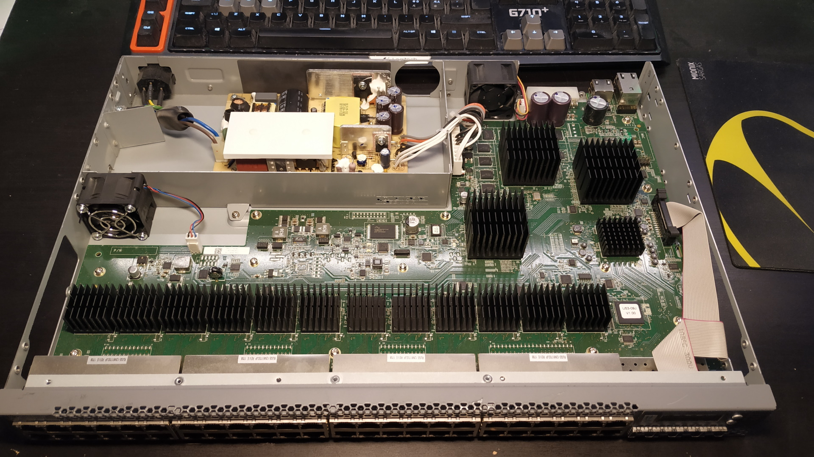



## Overview

Juniper EX3300 is an L3 switch with 24/48 Gigabit ports, 4 SFP+ ports and optional PoE. It's power usage isn't too bad and its fans aren't super noisy, but it can get even quieter. I'm not sure if I would mod the PoE versions due to higher power dissipation, so I'll disregard PoE versions in this small guide.

It uses two beefy 40mm fans with standard 3-pin fan pinout, running at pretty low RPMs at idle. As my quiet replacement fans aren't as beefy and would not provide enough airflow at these low RPMs, I've connected them directly to the PSU 12V output to always run them at 100% (which is upstream of the original fan headers, so it should be completely fine).

## Parts

- 2x Noctua NF-A4x20 FLX
- 2x fan cable extenders (due to short fan cables and to avoid modifying the fan cables themselves)

## Images

## Steps

**TODO**


