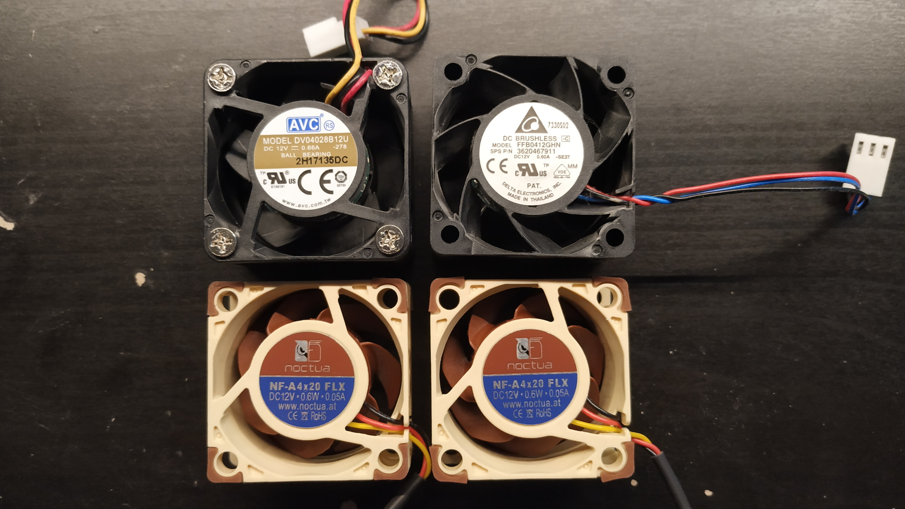
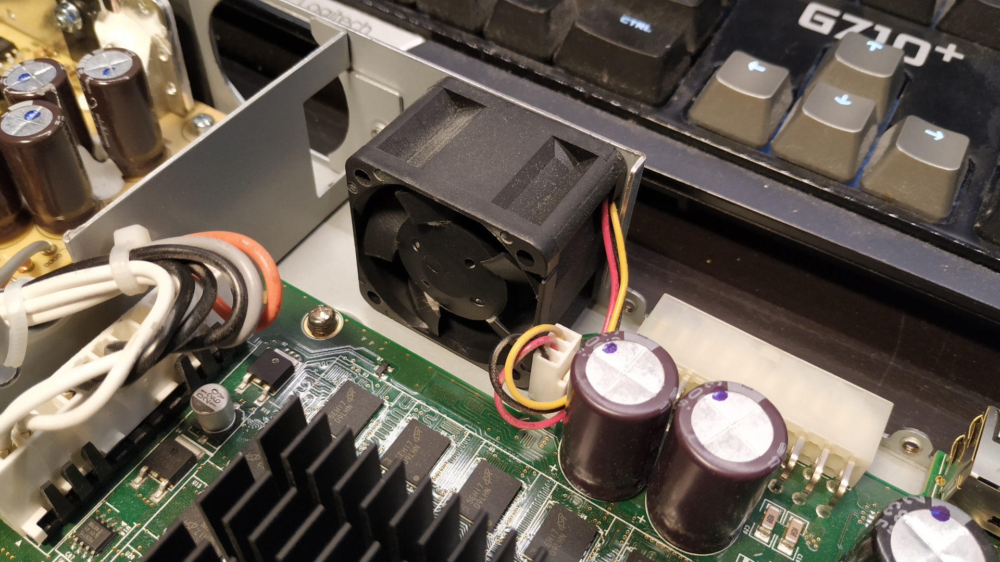
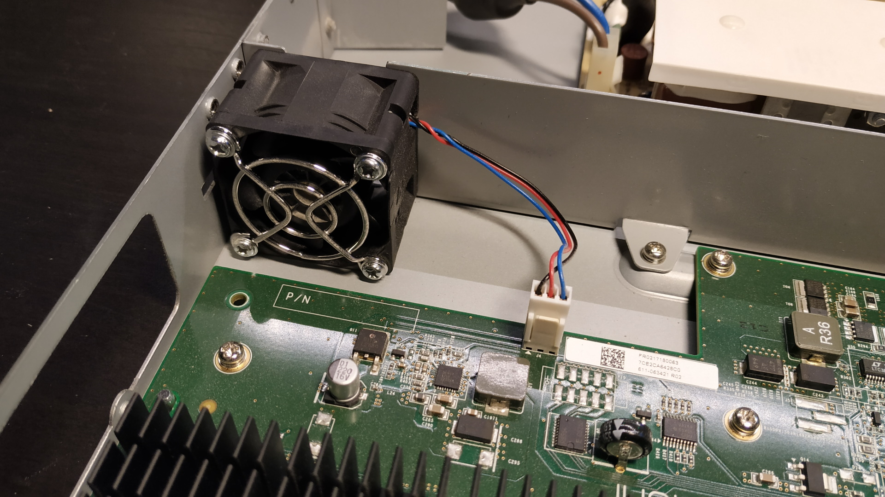
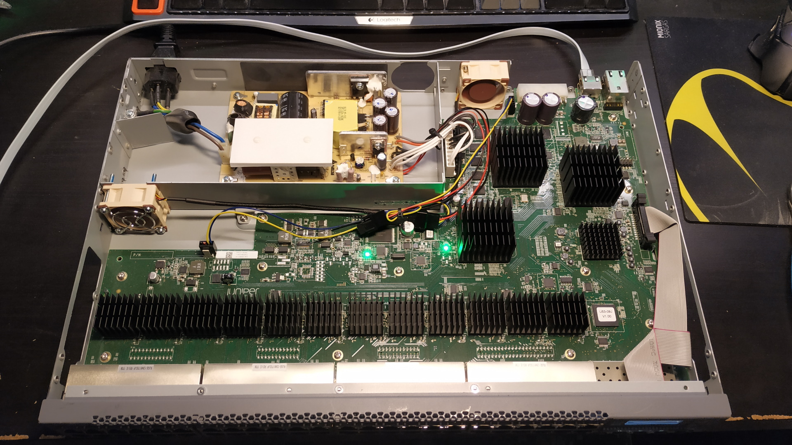
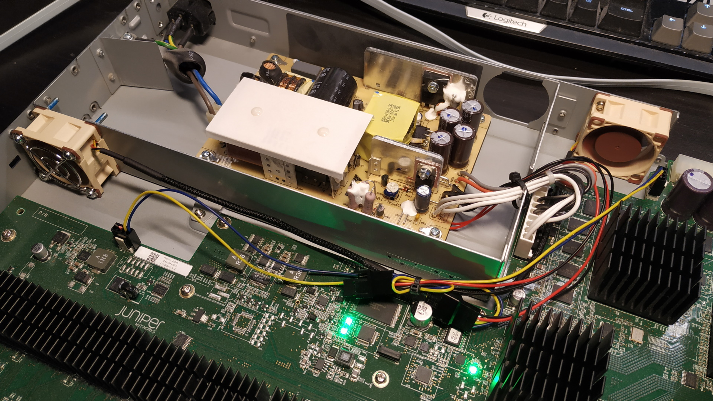
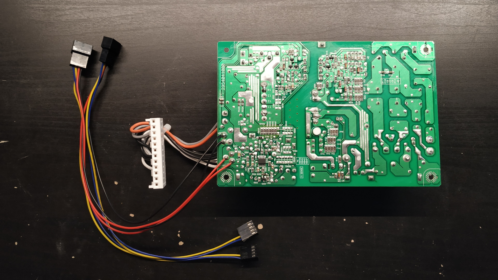



## Overview

Juniper EX3300 is an L3 switch with 24/48 Gigabit ports, 4 SFP+ ports and optional PoE. It's power usage isn't too bad and its fans aren't super noisy, but it can get even quieter. I'm not sure if I would mod the PoE versions due to higher power dissipation, so I'll disregard PoE versions in this small guide.

It uses two beefy 40mm fans with standard 3-pin fan pinout, running at pretty low RPMs at idle. As my quiet replacement fans aren't as beefy and would not provide enough airflow at these low RPMs, I've connected them directly to the PSU 12V output to always run them at 100% (which is upstream of the original fan headers, so it should be completely fine). If you have more beefy fans available, you can avoid this little hack and just drop-in replace the original fans.

## Disclaimer

I take no responsibility if this destroys your switch, burns your house down and/or electrocutes you.

## Parts

- 2x Noctua NF-A4x20 FLX (3-pin 40mm). Any 3-pin or 4-pin fan should work if you're going for the 100% fan speed hack.
- (Optional) 2x fan cable extenders. I used these due to the short Noctua fan cables and to avoid modifying the fan cables themselves in case I want to reuse the fans later.

## Images

**Old and new fans.** The one with screws is the back fan.

**Original switch.**

**Original back fan.**

**Original PSU fan.**

**Modded switch.**

**Modded switch again.**

**Backside of PSU.** Notice the 12V and GND wires from the fan cable extenders soldered onto it.

## Steps

If you're not going for the 100% speed hack then ignore the steps about unmounting the PSU PCB, splitting the fan cable and soldering it to the PSU.

1. Open the chassis. There are some hidden screws behind the rack ears and the DC input cover.
1. Unmount the back fan, the PSU chassis, the PSU fan and the PSU PCB.
1. Disconnect the GND and 12V wires from the connector on the new fan cables, but keep the tachometer wire connected. If you're using a 4-pin extender, you can just leave the fourth wire connected as well as it's not used anyways. Solder the GND and 12V wires onto the backside of the through-hole solder points for the power outputs of the PSU (where the cable to the switch PCB is connected). Conect the fan connectors with the tachometer wire to the original fan outputs on the switch.
1. Remount the PSU PCB, PSU fan, PSU chassis and back fan.
1. Cable manage the new fan cables a bit as to not restrict airflow too much.
1. Power the switch on with the chassis still open.
1. Make sure both fans are physically blowing at full speed.
1. Wait for it to boot. Make sure that it registers the fans as spinning (`show chassis environment`) and that no alarm is present for the fans (`show chassis alarms`).
1. Power off the switch and close the chassis.


